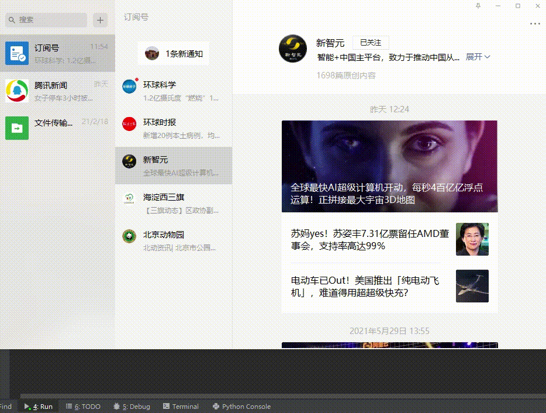

# wechat-gongzhonghao-crawler(微信公众号爬虫)



这个项目是通过pywinauto控制windows(win10)上的微信PC客户端来实现公众号文章的抓取。代码分成server和client两部分。server接收client抓取的微信公众号文章，并且保存到数据库。另外server支持简单的搜索和导出功能。client通过pywinauto实现微信公众号文章的抓取。

## 安装和部署
### Server的安装

Server由Java实现，理论上可以部署到Client可以访问的任何服务器上，这里假设Server和Client都安装在一台windows 10的机器上。

#### 安装mysql 5.7
用户可以在[这里](./tools/mysql-installer-community-5.7.33.0.msi)下载mysql，也可以去官网下载，但是请注意：目前只支持5.X版本的mysql。下面介绍在win10上安装的过程。

##### 安装
执行下载msi的安装文件，在"Choosing a Setup Type"里选择"Server only"。 然后点击next安装。安装完了需要配置。

##### mysql配置

"Type and Networking"，可以选择"Development Computer"，如果机器的资源比较丰富，也可以选择"Server Computer"。 "Accounts and Roles"设置root密码。 "Windows Service"使用默认设置。 

##### 修改utf8编码

找到mysql服务的配置文件地址，可以在搜索栏输入"服务"，然后找到mysql服务，右键点击属性，找到mysql配置文件的位置，如下图所示： 


图中显示配置文件的位置为"C:\ProgramData\MySQL\MySQL Server 5.7\my.ini"，修改这个文件，加入：

```
[client]
default-character-set=utf8mb4
[mysql]
default-character-set=utf8mb4
[mysqld]
init-connect='SET NAMES utf8mb4'
collation_server=utf8mb4_unicode_ci
character_set_server=utf8mb4
character-set-server=utf8mb4
```

注意：我们需要找到my.ini文件下面的\[client\]，然后把default-character-set=utf8mb4加到它的下面。类似的，在\[mysql\]和\[mysqld\]下面加入那些内容。 注意：不能直接把上面的文本复制到mysql.ini文件。ini文件是用"\[client\]"分成不同的部分的。 修改后重启服务，如下图所示： 


可以用下面的sql命令检查配置是否正确：

mysql> SHOW GLOBAL VARIABLES WHERE Variable_name LIKE 'character\_set\_%' OR Variable_name LIKE 'collation%';

结果应该是：

```
+--------------------------+--------------------+
| Variable_name            | Value              |
+--------------------------+--------------------+
| character_set_client     | utf8mb4            |
| character_set_connection | utf8mb4            |
| character_set_database   | utf8mb4            |
| character_set_filesystem | binary             |
| character_set_results    | utf8mb4            |
| character_set_server     | utf8mb4            |
| character_set_system     | utf8               |
| collation_connection     | utf8mb4_unicode_ci |
| collation_database       | utf8mb4_unicode_ci |
| collation_server         | utf8mb4_unicode_ci |
+--------------------------+--------------------+
10 rows in set (0.00 sec)
```

##### 建表
在开始菜单寻找"Mysql 5.7 Command Line Client - Unicode"，点击后命令行执行 mysql -u root -p，输入root密码后执行下面的命令：

```
# run as root
CREATE DATABASE `wechat`;
CREATE USER 'wechat'@'localhost' IDENTIFIED BY 'mypass';
GRANT ALL PRIVILEGES ON wechat.* TO 'wechat'@'localhost';
FLUSH PRIVILEGES;
```

如果需要，也可以修改wechat的密码为其它值，但是后面的配置文件也需要设置成对应的密码。 然后exit退出，然后用wechat账号重新登录：mysql -u wechat -p，并创建表：

```
use wechat;
CREATE TABLE `webpage` (
  `id` int(11) NOT NULL AUTO_INCREMENT,
  `url` varchar(512) NOT NULL,
  `title` varchar(1024) NOT NULL,
  `pub_name` varchar(128) NOT NULL,
  `pub_time` datetime DEFAULT NULL,
  `html` mediumblob,
  `content` mediumtext,
  `last_update` datetime DEFAULT NULL,
  `crawl_wechat_id` varchar(128) DEFAULT NULL,
  PRIMARY KEY (`id`),
  UNIQUE KEY `url` (`url`),
  KEY `last_update` (`last_update`),
  KEY `pub_name` (`pub_name`),
  KEY `crawl_wechat_id` (`crawl_wechat_id`)
) ENGINE=InnoDB  DEFAULT CHARSET=utf8mb4;


CREATE TABLE `state` (
  `id` int NOT NULL,
  `url` varchar(512) NOT NULL,
  `pub_name` varchar(128) NOT NULL,
  `title` varchar(1024) NOT NULL,
  `crawl_state` tinyint NOT NULL, # 1: 未抓取网页, 0: 抓取成功, 2: 失败1次 3: 失败2次,...
  `counter_state` tinyint NOT NULL, # 1: 未更新计数, 0: 更新成功, 3: 失败1次 ....
  `first_add` datetime NOT NULL,
  `last_update` datetime NOT NULL,
  `sync_page` tinyint NOT NULL, # 0 未同步，1已同步
  `sync_counter` tinyint NOT NULL,
  PRIMARY KEY (`id`),
  KEY `pub_name` (`pub_name`),
  KEY `crawl_state` (`crawl_state`),
  KEY `counter_state` (`counter_state`),
  KEY `sync_page` (`sync_page`),
  KEY `sync_counter` (`sync_counter`)
) ENGINE=InnoDB  DEFAULT CHARSET=utf8mb4;

CREATE TABLE `heartbeat` (
  `crawl_wechat_id` varchar(128) NOT NULL,
  `activity_type` varchar(256) NOT NULL,
  `last_update` datetime NOT NULL,
  PRIMARY KEY (`crawl_wechat_id`)
) ENGINE=InnoDB  DEFAULT CHARSET=utf8mb4;


CREATE TABLE `debuginfo` (
  `crawl_wechat_id` varchar(128) NOT NULL,
  `content` MEDIUMTEXT,
  PRIMARY KEY (`crawl_wechat_id`)
) ENGINE=InnoDB  DEFAULT CHARSET=utf8mb4;
```

阅读数的表：

```
CREATE TABLE `counter` (
  `id` int(11) NOT NULL,
  `read_count` int DEFAULT -1,
  `last_update` datetime NOT NULL,
  `crawl_wechat_id` varchar(128) NOT NULL,
  PRIMARY KEY (`id`)
) ENGINE=InnoDB  DEFAULT CHARSET=utf8mb4;
```

如果用户从v1.0升级到v1.1，则只需要新增counter表就行。

#### 安装JDK并启动服务

用户可以在[这里](./tools/jdk-8u271-windows-x64.exe)下载JDK，或者根据自己的机器选择其它版本的JDK。安装后需要设置环境变量，确保可以通过cmd运行Java。

jdk的安装使用默认选项就可以。启动命令行，输入java确认安装成功。如果找不到请设置PATH环境变量，具体可以上网搜索。 在[release](https://github.com/fancyerii/wechat-gongzhonghao-crawler/releases)下载最新版本的wechat-crawler-server-...-jar-with-dependencies.jar。把这个jar包放到某个文件夹下，然后在这个文件夹下创建一个conf的目录。在conf下新建一个dfConf.properties配置文件，然后修改其内容：

```
MYSQL_DRIVER=org.gjt.mm.mysql.Driver
MYSQL_URL=jdbc:mysql://localhost:3306/${db}
MYSQL_USER=wechat
MYSQL_PASS=mypass
```
主要是修改密码。

然后在命令行执行：
```
java -cp weichat-crawler-server-1.0-jar-with-dependencies.jar com.github.fancyerii.weichatcrawler.server.service.WeichatCrawlerServer
```

### Client的安装

#### 安装和登录微信

请下载的[微信安装程序](./tools/jdk-8u271-windows-x64.exe)安装，安装完成后参考[这篇文章](https://jingyan.baidu.com/article/656db9184040b5a380249c66.html)禁止微信自动升级，然后扫码登录。请读者使用3.1版本的微信客户端，因为版本升级或者变化可能导致代码无法正常运行。

#### 系统设置
因为爬虫的工作原理是控制微信，所以需要去掉windows的自动锁屏功能。具体方法可以参考[这篇文章](https://jingyan.baidu.com/article/91f5db1b00c5b31c7f05e3cb.html)。

#### 安装tesseract
v1.1新增，如果需要抓取阅读数需要安装它。安装方法参考[这里](https://fancyerii.github.io/2021/05/25/pywinauto-wechat-crawler-3/#%E5%AE%89%E8%A3%85windows%E7%89%88%E6%9C%AC%E7%9A%84tesseract)，请记得确认安装的路径是“C:\Program Files\Tesseract-OCR\tesseract”，目前的代码还不能配置这个路径。

#### 设置客户端
首先去[release](https://github.com/fancyerii/wechat-gongzhonghao-crawler/releases)下载最新版本的cli.exe，把它放到某个目录下，然后在这个目录创建config.ini文件和gongzhonghao.txt两个文件。config.ini可以参考这个： 

```
[basic]
java_server = http://127.0.0.1:4567
max_crawl_pages = 3
win_width = 1000
win_height = 600
lock_input = False
first_pages = 30
latest_date = 2021-01-01
first_max_crawl_time = 3600
switch_gongzhonghao = 北京动物园
```

主要配置说明：
* lock_input
    * 它的作用是锁定屏幕，从而保证系统安全
* max_crawl_pages
    * 更新时(不包括第一次抓取)最多往前翻页数量
* first_pages
    * 第一次抓取时最大的翻页数量
* latest_date
    * 第一次抓取时的最早日期，这个条件和前面的first_pages哪个满足都会跳出第一次抓取
* switch_gongzhonghao
    * 由于抓取的原理，则需要通过切换账号才能实现得到最新的文章，如果在gongzhonghao.txt里只配置了一个公众号，则需要配置用于“切换”刷新的公众号。
* first_max_crawl_time
    * 单位是秒。为了避免第一次刷新的时间过程，这个参数会让代码跳出循环。比如有10个公众号，假设每个公众号第一次抓取要一天。如果没有这个设置，那么第一次抓取可能会需要10天，当第一次结束后默认更新时只抓取3页，那么如果某个公众号在10天里更新超过3页，就有可能漏过。配置了这个参数上之后，比如抓取第一个公众号的第一次需要1天，它超过了3600s，则会跳出循环，然后再次循环，再次抓取公众号1，这会很快，然后第一次抓取公众号2，花一天时间，然后又退出；然后再次抓取公众号1和2，然后又花一天抓取公众号3，……，这样就能保障不会漏抓。
* crawl_read_count
    * v1.1新增，默认为False。如果需要抓取阅读数，则需要设置为True
* counter_interval_seconds
    * v1.1新增，默认为172800(两天)。表示当前距离文章的发布时间超过它(两天)才抓取阅读数


#### 配置公众号
为了告诉爬虫抓取哪些公众号，需要在gongzhonghao.txt里配置要抓取的公众号名(注意是名字而不是id)。 比如：
```
环球科学
北京海淀
```
注意：PC客户端无法实现关注公众号的功能，我们需要手动在手机微信里关注这些公众号！！！！ 

#### 启动爬虫

首先通过手机扫描登录微信PC客户端，然后双击cli.exe运行。请关注命令行的输出，如果有错误信息请通过issue反馈，请详细描述问题并且导出调试信息。获取调试信息参考下面。

#### 调试信息

请执行如下命令收集信息反馈给开发者：
```
java -cp weichat-crawler-server-xxx-jar-with-dependencies.jar com.github.fancyerii.weichatcrawler.server.service.DumpDebugInfo debug-info.txt
```

请把debug-info.txt发送给开发者进行诊断。 


## 查看抓取数据
使用浏览器打开[这里](http://localhost:4567/search)，就可以搜索公众号文章，下方的【下载JSON】链接也可以导出下载的文章。UI比较丑陋，欢迎大家发pull request改进ui。

## 开发者

### clone代码

因为在tools里有微信和mysql等很大的安装程序，是通过LFS存储的。如果直接clone会很慢而且没有必要，可以设置环境变量GIT_LFS_SKIP_SMUDGE=1来忽略它们：
```
GIT_LFS_SKIP_SMUDGE=1 git clone https://github.com/fancyerii/wechat-gongzhonghao-crawler.git
cd wechat-gongzhonghao-crawler
```

### 编译Server代码

```
$ cd server
$ mvn compile assembly:single
```

编译后的jar包在target/wechat-crawler-server-1.0-jar-with-dependencies.jar，它包含了所有的依赖。

### Client代码

安装依赖：
```
pip install -r requirements.txt
```

然后直接运行cli.py即可。

### Client打包成exe文件

需要安装pyinstaller：
```
pip install pyinstaller
```
然后用pyinstaller打包：
```
cd client
pyinstaller.exe --onefile cli.py
```

如果是python3.6的话可能会出现“The win32ui module could not initialize the application object”的错误，参考[这篇文章](https://www.cnblogs.com/banyanisdora/p/14272647.html)，可以协助300版本安装228：
```
pip uninstall pywin32
pip install pywin32==228
```

### 把本地抓取的数据同步到中心服务器

如果抓取的微信公众号特别多，那么可能我们会部署多台服务器进行抓取。按照默认配置，每台机器抓取的结果都保存在本地的mysql中。当然我们可以写一些脚本把这些数据进行汇总，但是仍然有一些逻辑需要考虑，比如增量同步等等。为了避免这些麻烦，本项目提供了数据同步的功能。

为了实现这个功能，需要有一台可以被抓取服务器访问的中心服务器，我们这里假设中心服务器的域名为center_server(如果没有域名可以改成外网ip)。

#### 中心服务器建表


我们首先在中心服务器的mysql上建立wechat数据库，设置用户名和密码。然后建立如下表：

```


use wechat;

CREATE TABLE `all_pages` (
  `url` varchar(512) NOT NULL,
  `title` varchar(1024) NOT NULL,
  `pub_name` varchar(128) NOT NULL,
  `pub_time` datetime DEFAULT NULL,
  `html` mediumblob,
  `content` mediumtext,
  `last_update` datetime DEFAULT NULL,
  `crawl_wechat_id` varchar(128) DEFAULT NULL,
  PRIMARY KEY (`url`),
  KEY `last_update` (`last_update`),
  KEY `pub_name` (`pub_name`),
  KEY `crawl_wechat_id` (`crawl_wechat_id`)
) ENGINE=InnoDB  DEFAULT CHARSET=utf8mb4;

CREATE TABLE `all_counters` (
  `url` varchar(512) NOT NULL,
  `read_count` int DEFAULT 0,
  `star_count` int DEFAULT 0,
  `last_update` datetime NOT NULL,
  `crawl_wechat_id` varchar(128) NOT NULL,
  `rvs` mediumblob,
  PRIMARY KEY (`url`)
) ENGINE=InnoDB  DEFAULT CHARSET=utf8mb4;

CREATE TABLE `wechat_pass` (
  `wechat_id` varchar(128) NOT NULL,
  `pass` varchar(64) NOT NULL,
  PRIMARY KEY (`wechat_id`)
) ENGINE=InnoDB  DEFAULT CHARSET=utf8mb4;

```

#### 启动中心服务器的数据接受服务

修改配置文件conf/cfg.txt：

```
salt=chan_search
iv=3FZEMcOdhXdXsYgQZR7LPw==
clear_pass=12345
```

参数salt和iv是加密用的，可以修改，但是下面Java Server的配置文件需要使用相同的值。clear_pass是通过远程的方式清除缓存密码的密码，这是远程(非本地)可以访问的，一定要修改为一个安全的密码。

```
nohup java -cp weichat-crawler-server-1.1-SNAPSHOT-jar-with-dependencies.jar com.github.fancyerii.weichatcrawler.server.service.WeichatSyncServer 2>&1 &
```

#### 为客户端创建用户名和密码

为了安全考虑，客户端往中心服务器同步数据时会进行加密。因此需要在wechat_pass表里为客户端建立密码：

```
insert into wechat_pass values('wechat_id', 'pass');
```

注意：我们需要把wechat_id替换成Windows客户端登录的微信id；密码改成一个安全的密码。这个密码在后面的配置中会用到。

#### Java Server设置
在cfg.txt里设置：
```
server_url=http://center_server:7654
do_sync=true

wechat_id=....
enc_pass=
salt=chan_search
iv=3FZEMcOdhXdXsYgQZR7LPw==
```

配置说明：

* server_url
    * 设置中心服务器的url，前面的WeichatSyncServer默认会监听在7654端口。
* do_sync
    * 设置为true时，Java Server会定期同步数据到中心服务器。否则不同步数据。
* wechat_id
    * cli.exe抓取时使用的微信id。
* enc_pass
    * 前面在中心服务器配置的密码。
* salt
    * 和中心服务器一致
* iv
    * 和中心服务器一致

设置后重启服务。注意：如果cli.exe还在执行，重启Java Server可能会丢失数据，因此建议等cli.exe在没有抓取或者关闭cli.exe后重启。


### 客户端代码介绍

请参考[使用pywinauto驱动微信客户端实现公众号抓取](https://fancyerii.github.io/2021/05/18/pywinauto-wechat-crawler/)。

## FAQ

### 抓取的时候电脑为什么干不了别的事情？
因为抓取的原理是通过鼠标键盘来控制PC版的微信客户端，它需要成为桌面的焦点，而且如果用户操作鼠标或者键盘，可能会导致控制失败。所以目前在抓取的时候电脑就不能用于办公了！所以建议利用晚上空闲的时间来进行抓取。

### 抓取的时候为什么不能锁屏，这样是不是很危险？
因为抓取的原理，如果锁屏的话程序就无法控制危险客户端，从而也就无法抓屏了。如果是在自己家里，应该风险不大。如果是在办公室里，建议配置lock_input=true，这样程序会锁定鼠标和键盘。锁定后我们可以使用【win+L】解除锁定并且锁屏，然后输入密码解锁。另外如果是台式机的话，建议抓取的时候关掉显示器，这样是不会影响抓取的。笔记本合上机盖可能会锁屏，读者可以搜索自己的笔记本品牌看看是否能够盒盖但是不锁屏。

### 能够抓取阅读数量等信息吗？
v1.1版本实现了阅读数的抓取。

### 能够抓取订阅号的文章吗？
目前还不行。


